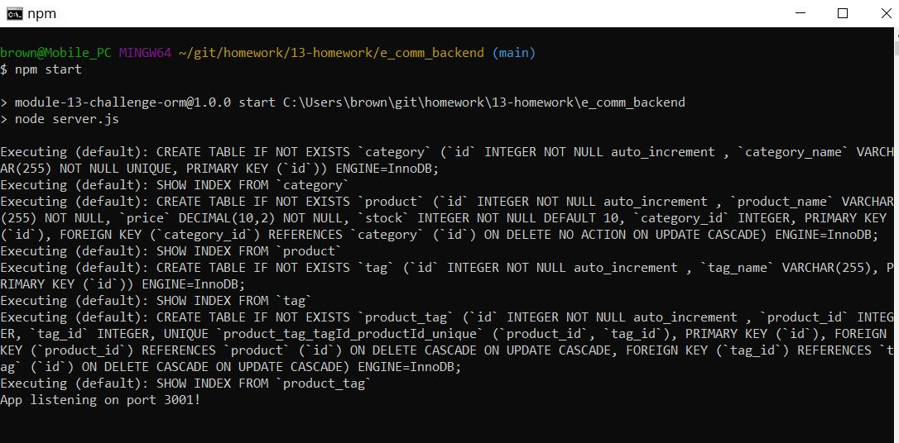
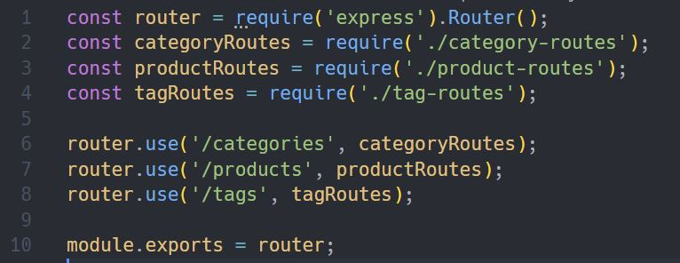
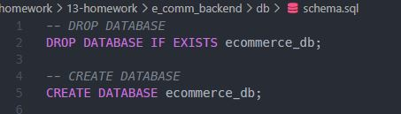
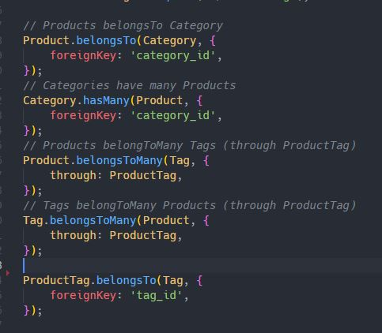
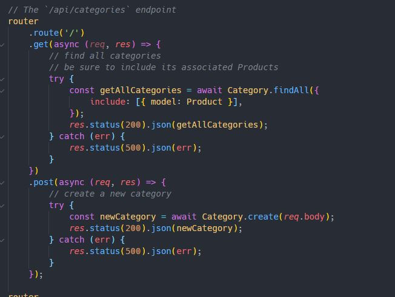
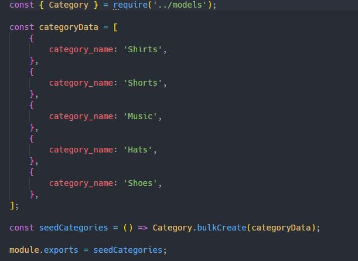
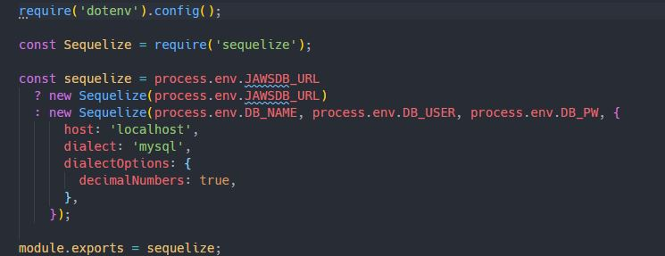
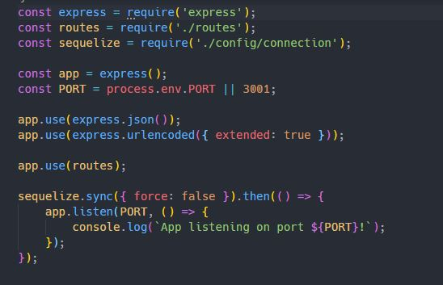

# E-Commerce Backend


## Description

- The backend setup for this e-commerce site will allow the site owner to
  utilize communication technologies and allows them to compete in the internet
  marketplace.
- The technology used for this application are: node, javascript, mysql2 (npm),
  express (npm), dotenv (npm), sequelize (npm), and nodemon (npm - dev only)
- The biggest challenge was working through sequelize and getting familiar with
  the documentation and how the relationships/associations work from table to
  table.

## Table of Contents

- [Installation](#installation)
- [Usage](#usage)
- [License](#license)
- [Contributing](#contributing)
- [Demo](#demo)
- [Questions](#questions)

## Installation

To install necessary dependencies, run the following command:

```
npm i
```

The following dependencies will be installed:

- mysql2
- express
- dotenv
- sequelize
- nodemon

## Usage

The user will start their server and allow the server to start listening for
incoming communication 

The server will then monitor for incoming messages and be listening on routes of
.../api/categories, .../api/products, .../api/tags


Informational query actions will perform a 'SELECT' query from mysql database to
get the requested data 

Add actions will perform an 'INSERT ITEM' query to add a new item to the mysql
database. 

Update actions will perform an 'UPDATE' query a specific record within the
database. 

Delete actions will perform a 'DELETE' query to remove a record from the
database 

## License

This project is licensed under the ISC license.

## Contributing

A thanks to the following contributors to this project:

- 2021 Trilogy Education Services, LLC
- Nicholas Brown (brownnicholasj.dev@gmail.com)

## Demo

Click the following link to watch video demo of the application (3min41sec
runtime)<br> https://youtu.be/AW5_VCIXF4w

### Demo Script

- 00:00 - start node app
- 00:05 - cycle through options
- 00:08 - View All Employees
- 00:18 - View Departments
- 00:23 - Add Department
- 00:38 - View Roles
- 00:43 - Add Role
- 01:00 - Add Role, trigger duplicate notification
- 01:18 - Add Employee
- 01:41 - View Employee by Department
- 01:53 - View Employee by Manager
- 02:05 - Update Employee Role
- 02:42 - Update Employee Manager
- 03:02 - Delete Dept, trigger dependency message
- 03:13 - Delete Role
- 03:22 - Delete Department
- 03:33 - View Utilized Budget

### Behind the Code

- Constructors created and stored to organize code and actions. This allowed me
  to build the application while minimizing possible bugs across multiple
  actions <br> 

- Main inquirer prompt serves and the navigation for the application. Users will
  be brought back to this menu after an action is completed: <br>
  

- switch method used to process the users selection to the proper action within
  the program: <br> 

- Functions used to ask for additional user input, if needed, and to give all of
  the properties to the proper constructor, based on the users selection: <br>
  

  

- Constructors requested the query using mysql and console.table the results<br>
  

- User inputs where the user must type (vs select), function used to format all
  input the same (capitalize first, lowercase the rest)
  

- 'Exit' option triggers the endConnection function to close the connection <br>
  

## Questions

If you have any questions about the repo, open an issue or contact me directly
at brownnicholasj.dev@gmail.com.You can find more of my work on my GitHub:
[brownnicholasj](https://github.com/brownnicholasj/).
